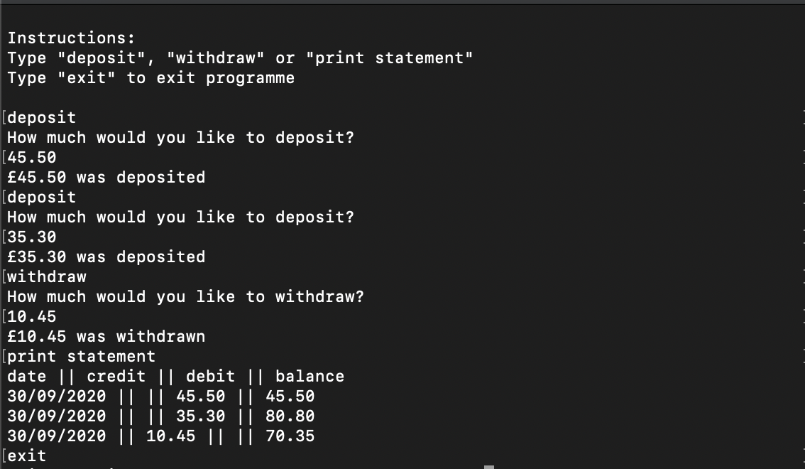

### Bank Tech Test - C#

A small project designed to highlight my code quality and process. [source](https://github.com/makersacademy/course/blob/master/individual_challenges/bank_tech_test.md)

I have also completed this tech test in [Node.js](https://github.com/tristanlangford/bank_tech_test) and [Ruby](https://github.com/tristanlangford/bank_tech_test_ruby).

It allows you to deposit, withdraw, and print statements.

## To run

1. Clone this repo.

2. Install dependencies with:

   ```shell
   dotnet restore 
   ```
3. Run tests with:

   ```shell
   dotnet test ./Bank_Tech_Test_C_Unit_Tests
   ```
4. Run the Program:

   ```shell
   dotnet run
   ```
5. Use the following inputs:

| Input                     | Description                                                                                        |
| -------------------------- | -------------------------------------------------------------------------------------------------- |
| `deposit`  | deposit however much you want into your account, this figure is in pounds with pence as decimals.  |
| `withdraw` | withdraw however much you want from your account, this figure is in pounds with pence as decimals. |
| `print statement`      | prints a statement of all transactions so far. |
| `exit`      | exit the program. |

## Example Screenshot


   
